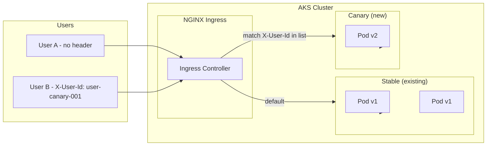
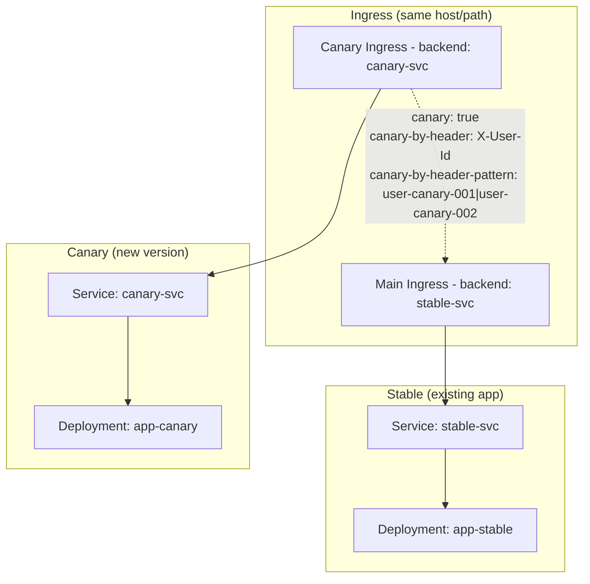

# Architecture: User-Based Canary on AKS

## High-Level Flow

## Request Path

1. **Request arrives** at NGINX Ingress (same host/path for everyone).
2. **Ingress evaluates canary rules**:
   - If `X-User-Id` (or your chosen header) matches the canary pattern (e.g. regex or exact value), request is sent to the **canary Service**.
   - Otherwise, request is sent to the **stable Service**.
3. **Stable Service** → existing deployment (e.g. app version 1).
4. **Canary Service** → new deployment (e.g. app version 2).

No downtime: stable keeps serving until you explicitly promote or change routing.

## Component Diagram

## Tooling Choice on AKS

| Layer | Choice | Why |
|-------|--------|-----|
| Ingress | **NGINX Ingress Controller** | Supports `canary-by-header`, `canary-by-header-value`, and `canary-by-header-pattern` (regex) for user-ID-based routing. Works with AKS Application Routing add-on or standalone install. |
| Orchestration | **Kubernetes Deployments** | Stable and canary are two Deployments; no need to replace existing Deployment. |
| Optional | **Argo Rollouts** | Use for automated canary steps (e.g. 20% → 50% → 100% by weight) and promotion; can be combined with header-based routing for “canary users” + “canary %” later. |

## Migrating from Recreate Strategy

If your current application uses **Recreate strategy** (`strategy.type: Recreate`), you'll need to:

1. **Remove the recreate strategy** from your Deployment (or convert it to stable)
2. **Add canary deployment** alongside stable
3. **Set up ingress routing** for header-based canary

See **[Migration Guide: Recreate → Canary](./03-Migrate-From-Recreate.md)** for step-by-step instructions.

**Key benefit**: Moving from recreate to canary eliminates downtime during deployments.

---

## Architecture Complications and Considerations

### 1. **User identification at the edge**

- **Issue**: Ingress only sees HTTP headers. Your app may identify users via JWT, session cookie, or backend lookup.
- **Mitigation**: Set a **trusted header** (e.g. `X-User-Id`) from a trusted component that already knows the user (e.g. API Gateway, Auth proxy, or frontend after login). In the POC we simulate by having the client send `X-User-Id`; in production this would be set by your gateway/auth layer.

### 2. **Sticky behavior (session affinity)**

- **Issue**: If the same user sometimes hits stable and sometimes canary (e.g. different devices or no cookie), experience can be inconsistent.
- **Mitigation**: Routing is **deterministic by user ID**: same `X-User-Id` always goes to canary (if in list) or always to stable. No need for session affinity on the canary path if the header is always set consistently for that user.

### 3. **Multiple user IDs**

- **Issue**: NGINX Ingress `canary-by-header-value` supports a single value; you need multiple user IDs.
- **Mitigation**: Use **`canary-by-header-pattern`** with a regex, e.g. `user-canary-001|user-canary-002|beta-tester-.*`. For many IDs, consider a small sidecar or lookup that sets a single header (e.g. `X-Canary: true`) for allowed users.

### 4. **Backend compatibility**

- **Issue**: Stable and canary might call different APIs or have different contracts.
- **Mitigation**: Keep backward compatibility; canary should be able to talk to same APIs as stable. Version APIs if needed and support both during canary.

### 5. **Metrics and observability**

- **Issue**: You need to compare stable vs canary (errors, latency, business metrics).
- **Mitigation**: Use consistent labels (e.g. `version=stable` / `version=canary`) on Deployments/Pods and scrape with Prometheus; use the same App Insights or logging with a version dimension. Optional: Argo Rollouts + AnalysisTemplate for automated promotion/rollback.

### 6. **Promotion and rollback**

- **Issue**: “Promote canary” means all users get the new version; rollback means canary users go back to stable.
- **Mitigation**: **Promote**: Point stable Deployment to new image and/or scale down canary and remove canary Ingress (or keep canary for next release). **Rollback**: Remove or disable canary Ingress so canary users fall back to stable; optionally scale down canary Deployment.

### 7. **No downtime**

- **Issue**: Changes must not drop existing traffic.
- **Mitigation**: Add canary Deployment and canary Ingress without changing stable; canary is additive. For promotion, update stable (e.g. rolling update) then adjust or remove canary; no delete-before-create of the main path.

## Security Notes

- **Do not** trust `X-User-Id` from untrusted clients in production. Set it in a trusted gateway or auth proxy after authentication.
- Prefer **canary-by-header-pattern** allowlists (explicit IDs or patterns) over “any value” to avoid abuse.

## References

- [NGINX Ingress canary annotations](https://kubernetes.github.io/ingress-nginx/user-guide/nginx-configuration/annotations/#canary)
- [AKS Application Routing (NGINX)](https://learn.microsoft.com/en-us/azure/aks/app-routing-nginx-configuration)
- [Argo Rollouts](https://argoproj.github.io/argo-rollouts/) (optional, for automated steps)
